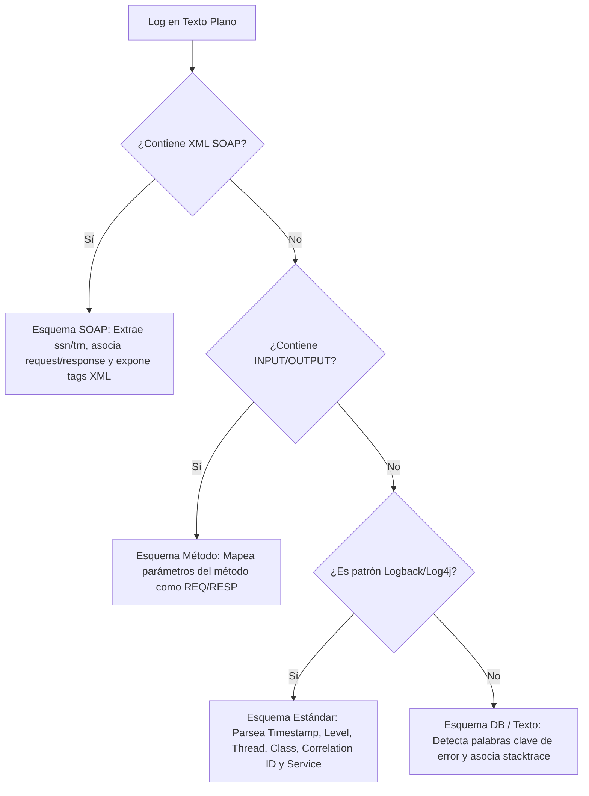

# 🔍 LogScope v5.0 - Analizador de Logs & Suite de Diagnóstico Premium para Capa Media

Bienvenido a **LogScope v5.0**, la herramienta definitiva de auditoría, diagnóstico y replicación de pruebas de rendimiento para ingenieros de control de calidad (QA) y desarrolladores de Capa Media. 

Diseñada bajo una estética moderna, fluida y con estilo **Glassmorphism** (basada en la paleta premium *One Dark Pro Darker*), LogScope transforma trazas de log planas y complejas en flujos de datos estructurados, interactivos y accionables.

---

## 🚀 Índice de Contenidos
1. [✨ Características Principales de LogScope](#-características-principales-de-logscope)
2. [📖 Manual del Usuario: Guía Paso a Paso](#-manual-del-usuario-guía-paso-a-paso)
3. [⌨️ Atajos de Teclado Profesionales](#%EF%B8%8F-atajos-de-teclado-profesionales)
4. [🧠 Funcionamiento del Smart Parser Integrado](#-funcionamiento-del-smart-parser-integrado)
5. [📊 Suite SVG de Analíticas y Salud de Red](#-suite-svg-de-analíticas-y-salud-de-red)
6. [🛠️ Estructura del Proyecto](#%EF%B8%8F-estructura-del-proyecto)
7. [⚙️ Instalación y Puesta en Marcha](#%EF%B8%8F-instalación-y-puesta-en-marcha)
8. [💾 Persistencia y Políticas de Almacenamiento](#-persistencia-y-políticas-de-almacenamiento)

---

## ✨ Características Principales de LogScope

LogScope v5.0 agrupa herramientas avanzadas de diagnóstico de integración estructuradas en cinco pilares clave:

### 1. 📂 Cronología Unificada e Integración de Archivos (Multi-File Timeline Merging)
*   **Qué hace:** Permite seleccionar múltiples archivos de log simultáneamente en el menú lateral izquierdo mediante un sistema de casillas de verificación personalizadas.
*   **Fusión Milimétrica:** Los archivos se procesan, ordenan y fusionan cronológicamente en un solo flujo unificado con precisión de milisegundos.
*   **Traceability:** Cada fila de log fusionada cuenta con una etiqueta de origen coloreada en tonos HSL desaturados, permitiendo identificar al instante de qué archivo e hilo provino la traza.

### 2. 📊 Diagramas de Secuencia UML Interactivos (SVG Tracing)
*   **Qué hace:** Cuando se aísla un **ID de Correlación**, el sistema genera dinámicamente un diagrama de secuencia UML en formato SVG interactivo.
*   **Mapeo de Actores:** Clasifica la traza en 4 actores esenciales: `Client` ➔ `Gateway` ➔ `Capa Media` ➔ `External (SOAP/ACH)`.
*   **Análisis de Latencia Visual:** Calcula la latencia exacta entre transacciones. Si un paso supera los `3000ms`, se destaca con un símbolo de alerta visual rojo (`!`).
*   **Navegación Interactiva:** Al hacer clic en cualquier flecha de secuencia del SVG, la tabla de logs se desplaza suavemente y resalta el log correspondiente abriendo su Drawer de Detalles.
*   **Exportador PlantUML:** Incluye un botón para copiar el código markup PlantUML estructurado de la secuencia en un clic.

### 3. 🧠 Consola de Consultas XPath y JSONPath (Zero-Dependencies)
*   **Qué hace:** Una terminal integrada en el Drawer de Detalles que detecta de manera inteligente el tipo de payload (XML o JSON).
*   **XPath de Alto Nivel:** Evalúa expresiones XPath sobre payloads XML mediante `DOMParser` nativo. Integra soporte para namespaces SOAP empresariales (`soap`, `soapenv`, `xsd`, `xsi`).
*   **JSONPath Recursivo:** Ejecuta consultas en notación de puntos o brackets (`$.data.cliente.tarjeta` o `$.items[0].id`) sobre payloads JSON. Soporta fallbacks de parseo tolerantes a errores para JSON relajados mediante constructores `Function`.

### 4. 🚀 Replicación, Mocking y Virtualización
*   **Colecciones de Postman (v2.1):** Genera dinámicamente un esquema JSON de colección que incluye la petición HTTP, el payload formateado, y las cabeceras deducidas (e.g. `Content-Type`, `X-Correlation-ID`) para su importación directa en Postman.
*   **Apache JMeter (.jmx):** Construye plantillas XML estructuradas de JMeter preconfiguradas con hilos de control, peticiones HTTP, proxies y gestores de cabeceras listos para pruebas de carga.
*   **Virtualización WireMock:** Exporta stubs listos para WireMock en formato JSON, mapeando el método, la URL y la respuesta real del log (incluyendo headers y cuerpo de respuesta).
*   **Proyectos de SoapUI (.xml):** Genera un proyecto nativo completo de SoapUI (`.xml`). Detecta de forma inteligente si el log contiene un payload **SOAP (XML)** o **JSON (REST)**, estructurando en consecuencia un enlace `WsdlInterface` con bindings SOAP o un servicio `RestService` con el recurso, método `POST` y payload correspondiente. Adicionalmente, inyecta las cabeceras personalizadas (`X-Correlation-ID`, `X-LogScope-Origin`) codificadas en formato XML fragmentado nativo de SoapUI.

### 5. 🔄 Comparadores Avanzados Lado a Lado
*   ** Myers LCS Diff (Payloads):** Confronta dos payloads estructurados en un visor de doble columna con scroll sincronizado. Las inserciones se marcan en verde (`+`) y las eliminaciones en rojo (`-`) con alineación perfecta de líneas.
*   **Header & Meta Diff (Metadatos):** Una pestaña secundaria en el modal de comparación que analiza diferencias tabulares detalladas entre cabeceras, latencias, delta, hilos de ejecución, clases de origen y archivos, resaltando discrepancias con etiquetas dinámicas de **DIFERENTE** o **IGUAL**.

---

## 📖 Manual del Usuario: Guía Paso a Paso

### Escenario A: Rastrear una Transacción Lenta en Capa Media
1.  **Selección de Archivos:** Selecciona los logs de interés en la sección **ARCHIVOS LOCALES** del menú lateral izquierdo.
2.  **Uso de Preajustes de Tiempo:** Si necesitas acotar la búsqueda, utiliza los botones rápidos de intervalo en la cabecera ("15m", "1h", "24h"). El sistema determinará los límites de tiempo relativos al registro más reciente del archivo para evitar desajustes históricos.
3.  **Localización de la Falla:** Filtra por nivel haciendo clic en la píldora **ERROR** o utiliza el botón rápido **Latencia Crítica** en la barra de filtros de QA.
4.  **Aislamiento del Flujo:** Haz clic en el botón **Aislar Flujo** o en el icono de embudo junto al ID de Correlación del log lento.
5.  **Análisis UML:** El diagrama SVG se dibujará en la parte superior. Observa los indicadores de tiempo en amarillo o las alertas en rojo para identificar en qué llamada (por ejemplo, del Gateway a la Base de Datos o a un servicio SOAP de ACH) se produjo el retraso.
6.  **Inspección del Payload:** Haz clic en la flecha de la interacción lenta en el diagrama de secuencia. Se abrirá el Drawer de Detalles con el mensaje del log.

### Escenario B: Consultar Elementos Específicos de un XML SOAP Gigante
1.  Abre el Drawer de Detalles del log que contiene la traza SOAP.
2.  Desplázate hacia abajo hasta la sección **Consola XPath**.
3.  Ingresa una expresión como `//soap:Body` o busca nodos internos específicos como `//trn:codigoRetorno`.
4.  El resultado evaluado se mostrará reactivamente abajo en texto verde estilizado, permitiéndote extraer códigos de error complejos sin necesidad de copiar y pegar el XML en editores externos.

### Escenario C: Exportar un Caso de Prueba para Ingeniería de Performance
1.  Con el Drawer de Detalles de la petición abierto, localiza el bloque **Replicador & Virtualización QA**.
2.  Haz clic en el botón **JMeter**.
3.  Se descargará un archivo `.jmx` formateado. Abre tu herramienta Apache JMeter local, importa el archivo e inicia directamente tus pruebas de carga con la misma estructura y datos del log auditado.

### Escenario D: Compartir una Evidencia de Error con otro QA
1.  Mientras depuras, marca los logs más relevantes de la falla utilizando el icono del **push-pin** (marcador).
2.  En la sección **SESIONES DE PRUEBA QA** del sidebar izquierdo, haz clic en **Exportar Sesión**.
3.  Se descargará un archivo `logscope_session_[fecha].json`. Envía este archivo a tu compañero de equipo.
4.  Tu compañero solo debe arrastrar y soltar el archivo en el botón de **Cargar Sesión** de su propio panel de LogScope. El aplicativo restaurará automáticamente el mismo archivo de log, los filtros aplicados, la correlación aislada y los logs pineados en pantalla.

### Escenario E: Generar y Probar un Proyecto de SoapUI para Mensajería SOAP o REST
1.  Dentro del Drawer de Detalles del log a depurar, dirígete a la sección **Replicador & Virtualización QA**.
2.  Haz clic en el botón **SoapUI**.
3.  El aplicativo autodetectará el tipo de payload. Descargará un archivo XML nativo de SoapUI con la configuración correspondiente a WSDL/SOAP (si el payload es XML) o RestService/REST (si es JSON).
4.  Abre la aplicación **SoapUI**, selecciona `File -> Import Project`, elige el archivo XML descargado y tendrás un proyecto estructurado con endpoints de desarrollo (`http://localhost:8080`), métodos de petición y cabeceras personalizadas (`X-Correlation-ID`) ya inyectadas y listas para su ejecución.

---

## ⌨️ Atajos de Teclado Profesionales

Optimiza tu velocidad de diagnóstico en producción utilizando atajos de teclado inspirados en entornos Vim y Gmail:

| Tecla | Acción | Ámbito de Uso |
| :---: | :--- | :--- |
| <kbd>j</kbd> | Seleccionar siguiente registro de log | Tabla de registros principal |
| <kbd>k</kbd> | Seleccionar registro de log anterior | Tabla de registros principal |
| <kbd>p</kbd> | Alternar marcado (Pin / Bookmark) | Registro seleccionado actualmente |
| <kbd>c</kbd> | Abrir Modal de Comparación ( Myers LCS ) | Habilitado al tener 2 logs en cola |
| <kbd>/</kbd> | Enfocar automáticamente la barra de búsqueda | Global (ignora si estás en un campo de texto) |
| <kbd>Esc</kbd> | Cerrar Drawer de detalles, Modales o Diálogos | Global |

---

## 🧠 Funcionamiento del Smart Parser Integrado

LogScope incorpora un motor inteligente de parseo en tiempo real que clasifica las trazas de texto plano de la Capa Media en cuatro esquemas normalizados:



### Tabla de Formatos de Entrada Admitidos

| Formato | Ejemplo de Estructura Parsed | Componentes Extraídos |
| :--- | :--- | :--- |
| **A (Standard Logback)** | `2026-05-21 15:52:09,500 INFO  [http-nio-8080] [Peticion ID: 7523] [Class: LoggingService] [Endpoint: /procesarPago] : Proceso exitoso` | Timestamp, Hilo, Level, ID de Correlación, Clase, Servicio/Endpoint, Mensaje |
| **B (Method In/Out)** | `21/05/2026 3:52:09 PM - 75231698 - METODO: liquidar - INPUT: {monto: 500}` | Método como servicio, INPUT/OUTPUT como REQ/RESP, ID de Correlación deducido |
| **C (SOAP Traffic)** | `[21-05-2026 15:52:09 REQ - ssn: 7523 - trn: 01]: <soap:Envelope>...` | `ssn` como ID de Correlación, Dirección REQ/RESP, XML parseado con namespaces |
| **D (DB Engine & general)**| `Error: Attempt to insert duplicate key in table...` | Prioridad alta auto-promovida a `ERROR`, stacktrace formateado |

---

## 📊 Suite SVG de Analíticas y Salud de Red

LogScope no es solo un visor secuencial, incluye una sección analítica interactiva que expone el estado de salud de los endpoints:

1.  **Histograma de Latencias (Performance Chart):**
    *   Grafica la distribución en milisegundos de las respuestas del servidor.
    *   **Acción Interactiva:** Al hacer clic en las columnas de latencia crítica, la tabla de logs filtra automáticamente para mostrar únicamente las transacciones correspondientes a dicho rango.
2.  **Distribución de Errores por Servicio (Donut Chart):**
    *   Muestra qué microservicio o endpoint SOAP está registrando el mayor porcentaje de fallas.
    *   **Acción Interactiva:** Al hacer clic en un segmento de la dona, el sistema aplica un filtro instantáneo aislando las trazas de ese servicio en la vista general.
3.  **Auditoría Ejecutiva (CSV Export):**
    *   Botón **Exportar Auditoría CSV** que descarga un archivo formateado con la sumatoria de métricas de rendimiento, ideal para presentaciones de nivel directivo.

---

## 🛠️ Estructura del Proyecto

El codebase sigue un patrón limpio de arquitectura desacoplada por capas:

```text
log-viewer/
├── public/                     # Carpeta de distribución pública y assets compilados
│   ├── assets/                 # CSS y JS de producción generados por Vite
│   └── index.html              # HTML base cargador
├── src/
│   ├── application/            # Lógica y filtros de aplicación (estadísticas, reglas)
│   ├── domain/                 # Entidades de dominio, algoritmos Diff y Smart Parsers
│   │   ├── diff/               # Myers LCS Diff Engine para comparaciones
│   │   ├── formatting/         # Prettifiers y Syntax Highlighters (XML, JSON, HTML)
│   │   └── models/             # Tipado TypeScript estricto de registros y reglas
│   ├── infrastructure/         # Consumo y streaming de API backend
│   └── presentation/           # Componentes visuales UI y tema tokens
│       ├── components/         # Modales, Drawer, Sidebar, SVG Charts y Selectors
│       ├── hooks/              # Manejadores de Estado (useLogViewerState) y Shortcuts
│       ├── theme/              # Fichero tokens.css (One Dark Pro Darker & Glassmorphism)
│       └── utils/              # Formateadores de fecha y constantes globales
├── server.js                   # Servidor Express API que transmite los logs locales
├── tsconfig.json               # Configuración del compilador TypeScript
└── vite.config.ts              # Configuración del empaquetador de módulos Vite
```

---

## ⚙️ Instalación y Puesta en Marcha

Para desplegar LogScope en tu estación de trabajo local, sigue los siguientes pasos:

### 1. Requisitos Previos
*   [Node.js](https://nodejs.org/) (v16.0.0 o superior recomendado).
*   `npm` (incluido con la instalación de Node).

### 2. Clonar / Acceder al Directorio
Navega a la carpeta de la aplicación visualizadora de logs:
```bash
cd "/home/andreudev/Downloads/Logs capa media/log-viewer"
```

### 3. Instalar Dependencias
Instala todos los paquetes requeridos por Vite, React y Express:
```bash
npm install
```

### 4. Lanzar el Servidor Backend (Express)
El servidor backend se encarga de escanear la carpeta contenedora en busca de archivos `.log` y `.txt`, y de enviarlos mediante buffers eficientes al frontend:
```bash
node server.js
```
*Por defecto, el backend se levantará en el puerto `8080` (o `3000` según configuración).*

### 5. Lanzar el Servidor de Desarrollo Frontend (Vite)
En otra terminal, corre el servidor de desarrollo interactivo de React con soporte HMR:
```bash
npm run dev
```
Vite levantará el entorno local en: 👉 **[http://localhost:5173](http://localhost:5173)** o en el puerto indicado en la consola.

### 6. Compilación de Producción
Para compilar y empaquetar el aplicativo con optimización estática:
```bash
npm run build
```

---

## 💾 Persistencia y Políticas de Almacenamiento

LogScope garantiza que tus espacios y configuraciones de depuración se mantengan intactos entre recargas gracias a una sincronización selectiva con `localStorage`:

*   **Pines/Marcadores (`pinnedLogsMap`):** Almacenado en formato de mapa indexado por nombre de archivo. Al volver a abrir un log cargado previamente, tus marcadores se restablecerán automáticamente sin pérdida de información.
*   **Historial de Filtros:** Mantiene guardados los estados de tus filtros predilectos de visualización.
*   **Ajuste de Línea (Word Wrap):** Recordado de forma persistente a través del estado React y sincronizado en storage, evitando que debas reconfigurarlo al cambiar de archivo o nivel de filtrado.
*   **Recuperación de Archivo Activo (`activeFileName`):** El visor almacena el nombre del último archivo de logs visualizado. Al recargar la página, se recupera automáticamente para que retomes tu trabajo en el mismo segundo donde lo dejaste.

---
*Desarrollado con pasión para ingenieros de Capa Media. LogScope v5.0.*
